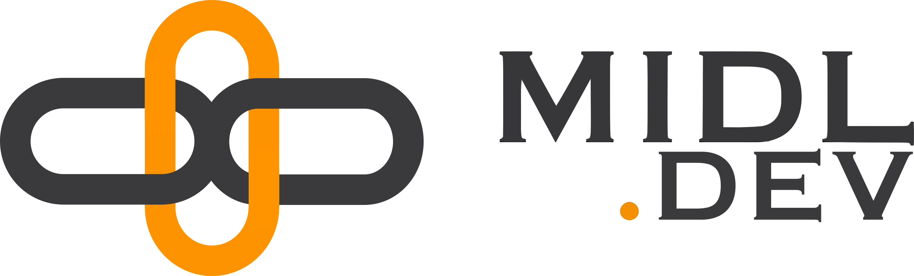

# Polkadot-k8s

This project is a collection of helm charts to help you deploy [Polkadot](https://polkadot.network) or [Kusama](https://kusama.network) validation infrastructure.

Features:

* compatible with Kusama and Polkadot
* download and import a [pre-synced database](https://polkashots.io) for faster synchronization of the node
* includes a [payout cronjob](charts/polkadot-payout) for automated payouts
* includes a [vote bot](charts/polkadot-votebot) for easy governance voting

Brought to you by MIDL.dev
--------------------------

We help you deploy and manage a complete Polkadot or Kusama validator infrastructure for you. [Hire us](https://midl.dev).
